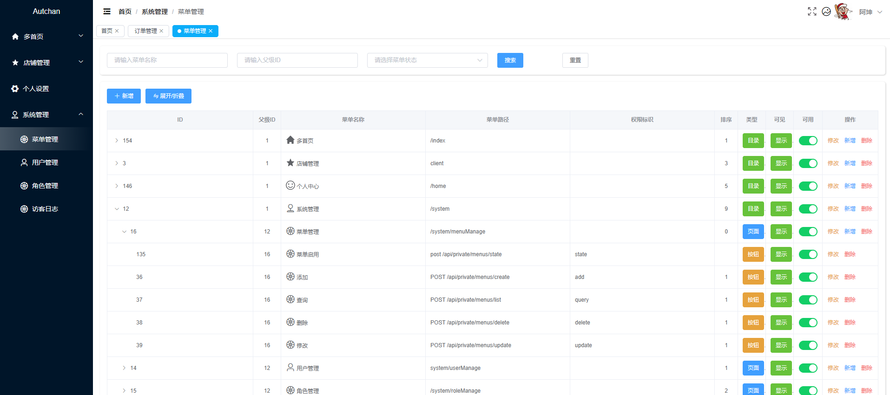
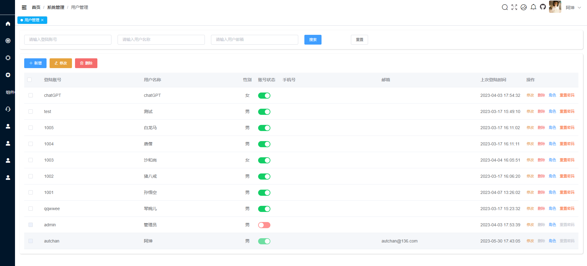
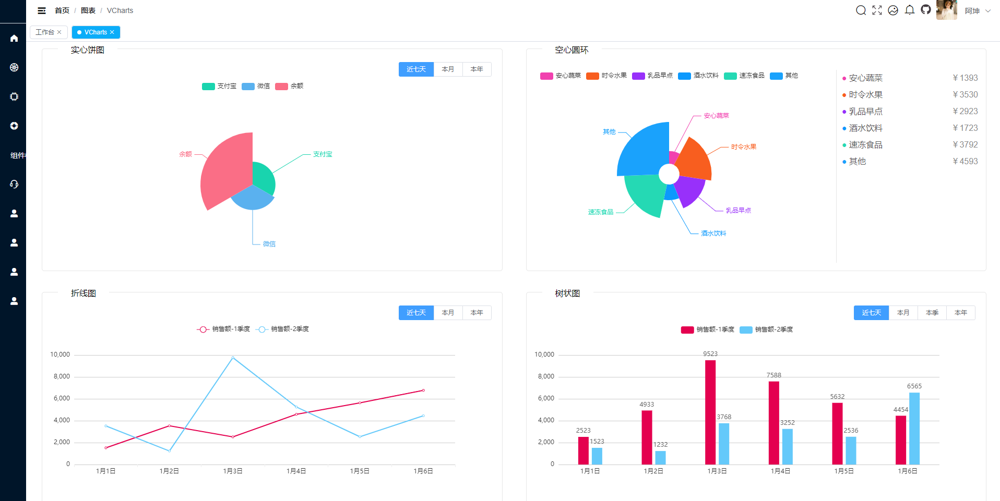
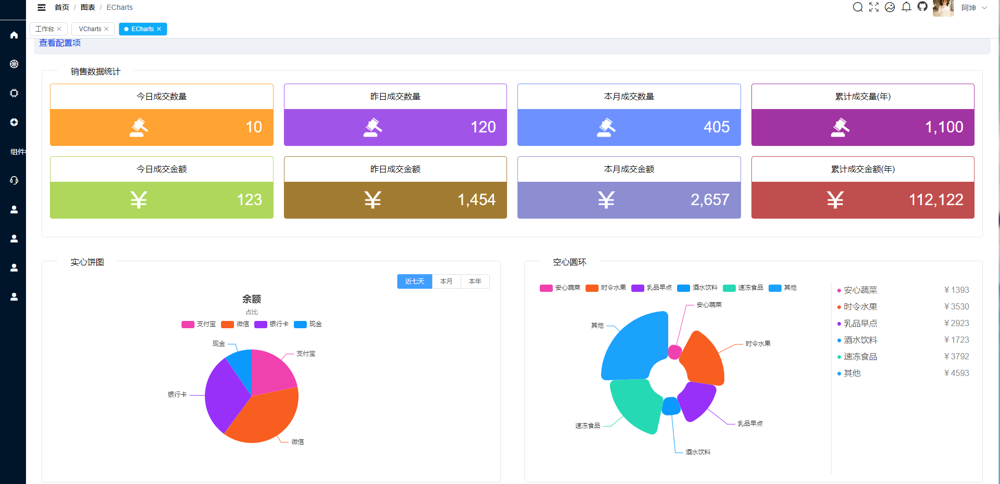
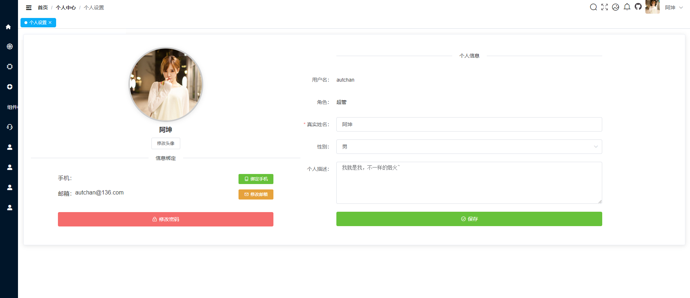
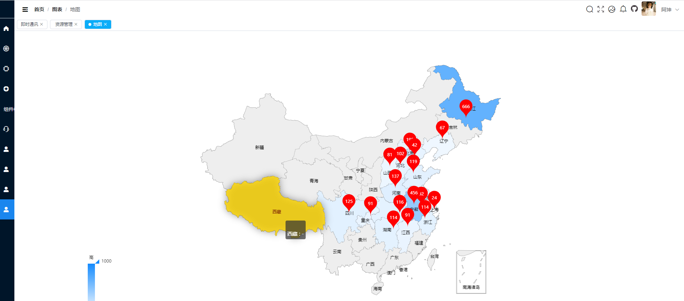
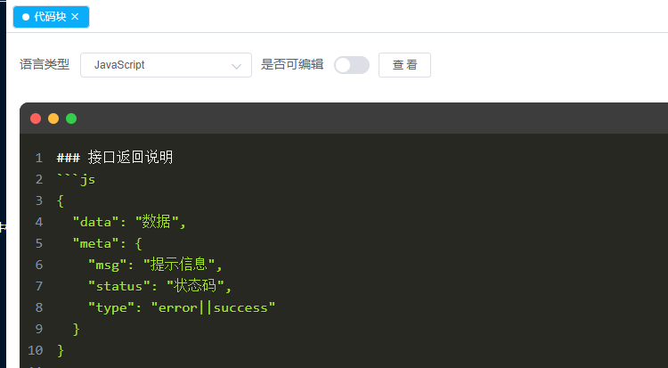

# vue2-admin

vue2 后台管理系统模板
[gitee 地址](https://gitee.com/todpole/vue2-admin)
[github 地址](https://github.com/autchan-ak/vue2-admin)


[github预览地址：](https://autchan-ak.github.io/vue2-admin.github.io/)https://autchan-ak.github.io/vue2-admin.github.io/


本项目可作为模板进行二次开发，基础功能均可以直接复用。

- 项目技术栈基于 `ES2015+、vue、vuex、vue-router 、vue-cli 、axios`；
- 支持本地 `mock` 数据 ( 基于 `Mockjs + webpack dev server` )；
- 支持异步请求代理；
- 支持模块化开发
- 支持权限化显示
- 自动发现并注册路由、`store`；
- 自动注册组件；
- .env.development.local 覆盖 env

### 安装依赖 node: '>=12.0.0'

```
npm install
```

### 启动项目

```
npm run serve
```

### 打包上线

```
npm run build
```

### 组件使用
#### md编辑器
- 支持参数：

| 属性名 | 类型 | 默认值 | 说明 |
|--|--|--|--|
| height | Number | 500 | 编辑器高度(px) |
| placeholder | String | 请输入内容 | 编辑器提示语 |
| mdContent | String |  | 编辑器内容 <br> v-model绑定|
| mode | String | editable | edit (纯编辑模式) <br> editable (编辑与预览模式) <br> preview (纯预览模式)| |
 
```html
  <!-- 查看 -->
  <MdEditor v-model="content" mode="preview" />
  <!-- 编辑 -->
  <MdEditor v-model="content" />

```
#### 表格组件
- 支持动态列，指定列排序`<ScreenTable>`
- 支持参数：

| 属性名 | 类型 | 默认值 | 说明 |
|--|--|--|--|
| list | Array |  | 表头数据 |
| table | Array |  | 表格数据 |
| current-page | Number | 1 | 分页 |
| page-size | Number | 15 | 每页条数 | 
| total | Number | 0 | 总条数 | 
| handleCurrentChange | Function |  | 改变页码后触发的方法 | 
| handleSizeChange | Function |  | 改变每页条数后触发的方法 | 
| tableSort | Function |  | 表格排序后触发的方法 | 
| btns | Slot |  | 操作按钮区域 | 

-----------------------------------------------------
- list 参数：

| 属性名 | 类型 | 默认值 | 说明 |
|--|--|--|--|
| label | String |  | 表头文字 | 
| prop | String |  | 对应数据字段 | 
| showOverflowTooltip | Boolean | false | 是否显示溢出提示 | 
| width | String / Number |  | 宽度 | 
| minWidth | String / Number |  | 最小宽度 |
| align | String | left | 对齐方式 | 
| type | String |  | 显示类型<br>time:时间格式\|tag:标签格式 | 
| format | String |  | 时间格式`type`为`time`时生效 | 
| tag | Object |  | 标签数组`type`为`tag`时生效 |
| sortable | String |  | 是否可排序 | 
| sort | String |  | 排序方式`sortable`有值时生效<br>可选值：asc \| desc |
| slot | Slot |  | 自定义插槽 | 

------------------------------------
- 标签数组`tag`参数：key为标签的索引，value为标签对象。

| 属性名 | 类型 | 默认值 | 说明 |
|--|--|--|--|
| label | String |  | 标签文字 | 
| type | String |  | 标签类型<br>success \| info \| warning \| danger \| text | 
| effect | String |  | 标签主题<br>dark \| light \| plain | 
| size | String |  | 标签大小<br>mini \| small \| medium | 


```html
    <ScreenTable
        :list="tableList"
        :table="tableData"
        :currentPage="page"
        :pageSize="size"
        :total="total"
        @handleCurrentChange="handleCurrentChange"
        @handleSizeChange="handleSizeChange"
        @tableSort="tableSort"
    >
      <div slot="btns">
        <el-button type="primary" size="small" @click="add">新增</el-button>
      </div>
      <div slot="operate">
        <el-table-column label="操作" width="100" align="center">
          <template v-slot="{ row }">
            <el-button type="text" size="mini" @click="view(row)"
            >查看</el-button>
          </template>
        </el-table-column>
      </div>
    </ScreenTable>
```


#### 下拉树形组件
- 支持参数：

| 属性名 | 类型 | 默认值 | 说明 |
|--|--|--|--|
| multiple | Boolean | false | 是否多选 |
| placeholder | String | 请选择 | 提示语 |
| clearable | Boolean | false | 是否可以清空选项 |
| filterable | Boolean | false | 是否可搜索 |
| disabled | Boolean | false | 是否禁用 |
| data | Array |  | tree数据 | 
| nodeKey | String / Number | id | 每个树节点用来作为唯一标识的属性，整棵树应该是唯一的 | 
| defaultProps | Object | {label: 'label',children: 'children'} |  | 
| value / v-model | String / Number |  | 绑定值 | 
| change | Function |  | 改变后触发的方法 | 
```html
<select-tree :data="list" v-model="value" @change="handleChange"/>
```

#### SVG使用
将 svg 保存在 `/src/assets/icon`

el 图标也可传入

```html
<svg-icon icon="name" />
```

### 默认启动为mock
- 账号：admin || test
- 密码：123456
### 项目截图







### 接口返回说明
```js
{
  "data": "数据",
  "meta": {
    "msg": "提示信息",
    "status": "状态码",
    "type": "error||success"
  }
}

"状态码":[
  "200":"成功，不带弹窗",
  "401":"token失效，重新登陆",
  "201":"成功，带弹窗",
]
```


### 目录结构说明

```
└──/assets/                   静态资源
│  ├── /icon/                 svg图标
│  ├── ...
│  ├──
├── /components/              全局组件
│  ├── index.js               自动注册 实例 入口
│  ├── ...
│  │
├── /directive/               全局指令
│  ├── index.js               自动注册 实例 入口
│  ├── ...
│  │
├── /filters/                 全局过滤器
│  ├── index.js               自动注册 实例 入口
│  ├── ...
│  │
├── /layout/                  布局页
│  ├── ...                    不多解释
│  │
├── /modules/                 模块开发
│  ├── /test/                 示例模版
│  ├── ...                    页面都在此处开发
│  │
├── /request/                 请求方法
│  ├── ...                    不多解释
│  │
├── /router/                  路由
│  ├── ...                    不多解释
│  │
├── /store/                   数据存储
│  ├── ...                    不多解释
│  │
├── /utils/                   工具方法文件夹
│  │  ├── BaseUtil.js         业务工具类
│  │  ├── ComponentUtil.js    注册组件类
│  │  ├── CryptUtil.js        加密工具类
│  │  ├── functions.js        公共方法类
│  │  ├── ProjectTools.js     保存信息类
│  │  ├── RegExpUtil.js       各种正则方法类
│  │  ├── theme.js            主题样式类
│  │  └── ...
├── package.json
├── README.md

```

### 最后

- 如果喜欢一定要 star哈!!!（谢谢!!）
- 如果有意见和问题 请在 lssues提出，我看到后会解答。
- 作者公众号


